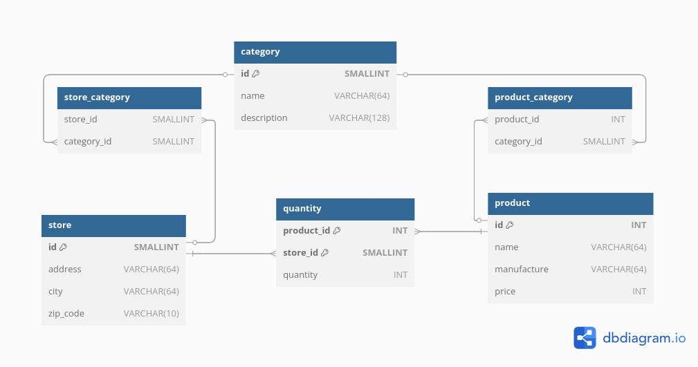

# Database Normalization Task

## Optimizing a Retail Network Inventory Management Database
You are working with an unstructured dataset for a retail network that sells products from multiple manufacturers in various stores. Different stores can sell identical products, but each store specializes in selling certain categories of products. Each product can belong to multiple categories, and the data is currently in **UNF (Unnormalized Form)**, violating normalization principles. Below is the raw data with product, store, category, price, and quantity information:

|ProductInfo|Category|StoreAddress|StoreCity|StoreZipCode|Quantity|
|:---:|:---:|:---:|:---:|:---:|:---:|
Product: Smartphone, Manufacturer: TechCo, Price: 800|Smartphones|123 Main St|New York|10001|10|
Product: Smartphone, Manufacturer: GadgetWorks, Price: 850|Smartphones|123 Main St|New York|10001|5|
Product: Smartphone, Manufacturer: TechCo, Price: 800|Smartphones|456 Oak Rd|Chicago|60601|7|
Product: Smartphone, Manufacturer: GadgetWorks, Price: 850|Smartphones|456 Oak Rd|Chicago|60601|12|
Product: Laptop, Manufacturer: TechCo, Price: 1200|Computers|456 Oak Rd|Chicago|60601|7|
Product: Laptop, Manufacturer: GadgetWorks, Price: 1150|Computers|456 Oak Rd|Chicago|60601|10|
Product: Tablet, Manufacturer: GadgetWorks, Price: 500|Electronics, Computers|123 Main St|New York|10001|15|
Product: Tablet, Manufacturer: TechCo, Price: 450|Electronics, Computers|123 Main St|New York|10001|20|
Product: Washing Machine, Manufacturer: HomeTech, Price: 400|Home Appliances|789 Pine Ave|Los Angeles|90001|25|
Product: Washing Machine, Manufacturer: CleanMaster, Price: 380|Home Appliances|789 Pine Ave|Los Angeles|90001|30|
Product: Headphones, Manufacturer: AudioTech, Price: 200|Electronics, Audio|456 Oak Rd|Chicago|60601|50|
Product: Headphones, Manufacturer: TechCo, Price: 220|Electronics, Audio|456 Oak Rd|Chicago|60601|40|

## Task:
Design a normalized database schema to improve efficiency, eliminate redundancy, and ensure data integrity. The schema should satisfy **at least 1NF, 2NF, 3NF, and 4NF** normal forms.

## Steps to Complete:
1. **Develop a new database schema** based on the given raw data, ensuring that it meets **1NF, 2NF, 3NF, and 4NF**.
2. **Write SQL statements** to create the normalized tables.
3. **Ensure that the relationships between entities** (such as products, manufacturers, stores, categories, and inventory) **are properly defined** with appropriate foreign keys.
4. **Design the relationships between stores and categories** so that each store specializes in specific categories of products.

## Key Considerations:
- **1NF Violation:** The **ProductInfo** column is not normalized as it combines multiple attributes in a single column, leading to redundancy.
- **2NF:** Ensure that all non-key attributes are fully dependent on the primary key.
- **3NF:** Remove transitive dependencies.
- **4NF:** Resolve multi-valued dependencies (e.g., products, stores, categories,)

# Solution

## ER Diagram of the Normalized Database
[ER Diagram online (dbdiagram.io)](https://dbdiagram.io/d/67b0a222263d6cf9a043af3a)
